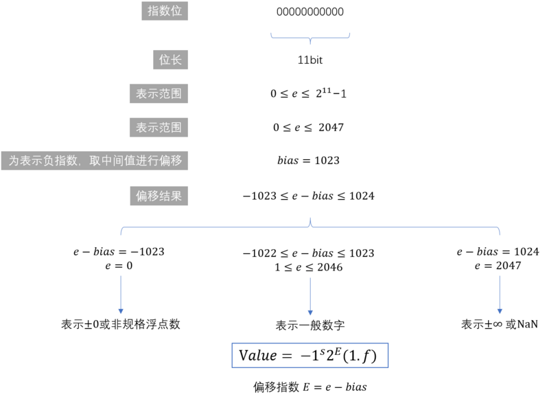
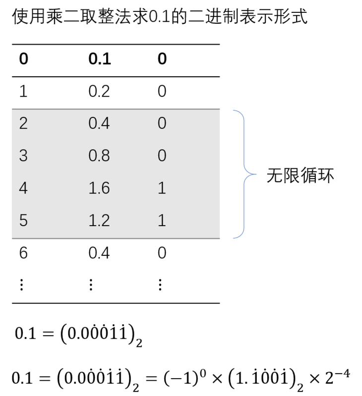

# Javascript 中为什么 0.1 + 0.2 === 0.3?

Number 作为 JavaScript 中的基本类型，无论是整数还是小数其类型都是双精度 IEEE754 64 位浮点类型。但是这就造成了一个精确计算的问题：0.1 + 0.2 === 0.3? 在浏览器控制台打印出来：


这种送分题，js 却送了命。令人窒息的操作。这个例子很常见，我们不是为了关注这个例子本身，我们需要明白的是为什么会出现这样的结果？哪一步出了问题？还有那些计算可能会出现这样的问题？怎么解决？

## IEEE754

在 IEEE754 中，双精度浮点数储存为 64 位：


指数位可以通过下面的方法转换为使用的指数值：



浮点数表示的值的形式由 `e` 和 `f` 确定。
这里有个疑问：
- 为什么 bias 是 1~2046？是因为指数位没有办法表示-1 等复数，所以 e=1024，base 就等于-1。
- 为什么`2 ** 11`要减1,因为二进制`0b11111111111`的最大值是`2 ** 11`

## JavaScript 是如何表示数字的？

JavaScript 使用 Number 类型表示数字（整数和浮点数），遵循 IEEE 754 标准 通过 64 位来表示一个数字

通过图片具体看一下数字在内存中的表示:


图片文字说明

- 第 0 位：符号位，0 表示正数，1 表示负数(s)
- 第 1 位到第 11 位：储存指数部分（e）
- 第 12 位到第 63 位：储存小数部分（即有效数字）f

## 根据 IEEE754 计算 0.1+0.2

### 1. 将 0.1 使用转换为二进制



由于小数位 仅储存 52bit, 储存时会将超出精度部分进行"零舍一入"

| 值类型     | 小数位(储存范围内)                                               | 小数位(储存范围外) |
| ---------- | ---------------------------------------------------------------- | ------------------ |
| 无限精确值 | 1001 1001 1001 1001 1001 1001 1001 1001 1001 1001 1001 1001 1001 | 1001 1001...       |
| 实际储存值 | 1001 1001 1001 1001 1001 1001 1001 1001 1001 1001 1001 1001 1010 | -                  |

由于计算加减时不会对指数位进行位运算，这里不计算指数位的表示，直接使用数字表示最终的指数值

0.1、0.2 的表示如下：

| 浮点数数值 | 符号位 `s` | 指数值 `E` | 小数位 `f`                                                       |
| ---------- | ---------- | ---------- | ---------------------------------------------------------------- |
| 0.1        | 0          | -4         | 1001 1001 1001 1001 1001 1001 1001 1001 1001 1001 1001 1001 1010 |
| 0.2        | 0          | -3         | 1001 1001 1001 1001 1001 1001 1001 1001 1001 1001 1001 1001 1010 |

### 2. 将 0.1 与 0.2 相加

在计算浮点数相加时需要先进行“对位”，将较小的指数化为较大的指数，并将小数部分相应右移


可以通过下面的方法检验计算结果是否于 js 中一致：

```javascript
0.1 + 0.2 === (-1)**0 * 2**-2 * (0b10011001100110011001100110011001100110011001100110100 * 2**-52)
//> true
//计算正确
```

## 计算 javascript Number 的特性

在js中 Number对象上附带了许多属性，表示可数的范围等信息，例如 Number.MAX_SAFE_INTEGER 是一个16位的数字，这一部分将解释如何计算出这些有特殊意义的数字

### 1.计算 Number.MAX_VALUE 和 Number.MIN_VALUE

当符号位为0、指数取到1023、小数位全为1时，为可表示的最大值

当符号位为0、指数位全为0（表示非规格浮点数）、小数位仅最后一位为1时，为可表示的最小正值

```javascript
var max = (-1)**0 * 2**1023 * (Number.parseInt( "1".repeat(53) ,2) * 2**-52);
max === Number.MAX_VALUE;
//> true

var min = (-1)**0 * 2**-1022 * (Number.parseInt( "0".repeat(52)+"1" ,2) * 2**-52);
min === Number.MIN_VALUE;
//> true
```
### 2.计算 Number.MAX_SAFE_INTEGER 和 Number.MIN_SAFE_INTEGER

`Number.MAX_SAFE_INTEGER`表示最大安全整数，它是9开头的16位数字，也表明js number最大精度不超过16位。

ECMASCRIPT-262 定义：

>The value of Number.MAX_SAFE_INTEGER is the largest integer n such that n >and n + 1 are both exactly representable as a Number value. [http://www.ecma-international](http://www.ecma-international.org/ecma-262/6.0/#sec-number.max_safe_integer)...

既然说到这里，再给大家科普一个小知识点：js 最大安全数是 Number. MAX_SAFE_INTEGER == Math.pow(2, 53) - 1, 而不是 Math.pow(2, 52) - 1, why？尾数部分不是只有 52 位吗?

这是因为二进制表示有效数字总是 1.xx…xx 的形式，尾数部分 f 在规约形式下第一位默认为 1（省略不写，xx..xx 为尾数部分 f，最长 52 位）。因此，JavaScript 提供的有效数字最长为 53 个二进制位（64 位浮点的后 52 位+被省略的 1 位）

改变指数位为53，这让每个小数位都表示浮点数的整数部分，小数位最低位对应 ，然后将每个小数位都置1，可得最大准确整数：

```javascript
var max_safe_int = (-1)**0 * 2**52 * (Number.parseInt("1".repeat(53),2) * 2**-52);
max_safe_int === Number.MAX_SAFE_INTEGER;
//> true
//当它 +1 时，可由 (-1)**0 * 2**53 * (Number.parseInt("1"+"0".repeat(52),2) * 2**-52) 正确表示，而再 +1 时则无法准确表示

//符号位取反可得最小安全整数
-1 * max_safe_int === Number.MIN_SAFE_INTEGER;
```
简单验证一下


### 3.计算 Number.EPSILON

Number.EPSILON 是一个极小值。*但并不是用来检测误差范围内的值*。 例如：

```javascript
Math.abs(0.1 + 0.2 - 0.3) < Number.EPSILON;
//> true

//2017-9-27 补充
1.1 + 1.3 - 2.4 < Number.EPSILON
//> false
```

根据 ECMASCRIPT-262 定义：

> The value of Number.EPSILON is the difference between 1 and the smallest value greater than 1 that is representable as a Number value, which is approximately 2.2204460492503130808472633361816 x 10‍−‍16.

[规范地址](http://www.ecma-international.org/ecma-262/6.0/#sec-number.epsilon)

根据定义Number.EPSILON是大于1的最小可表示数与1的差，可以据此计算出 Number.EPSILON 的值：

```javascript
//将表示1的二进制小数位的最左端置1，可表示大于1的最小数
var epsilon = (-1)**0 * 2**0 * (Number.parseInt("1"+"0".repeat(51)+"1",2) * 2**-52) - 1;
// (-1)**0 * 2**0 * (+`0b1${"0".repeat(51)}1` * 2**-52) - 1;
epsilon === Number.EPSILON;
//> true
```

<!-- ## 参考
[IEEE754 浮点数格式 与 Javascript number 的特性](https://segmentfault.com/a/1190000008268668)
[Number.EPSILON](https://developer.mozilla.org/zh-CN/docs/Web/JavaScript/Reference/Global_Objects/Number/EPSILON)
[0.1 + 0.2不等于0.3？为什么JavaScript有这种“骚”操作？](https://juejin.im/post/5b90e00e6fb9a05cf9080dff) -->
